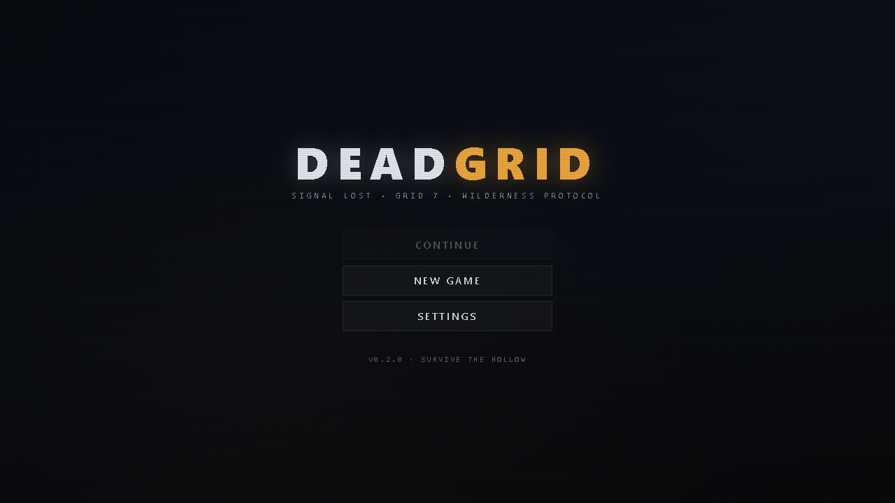
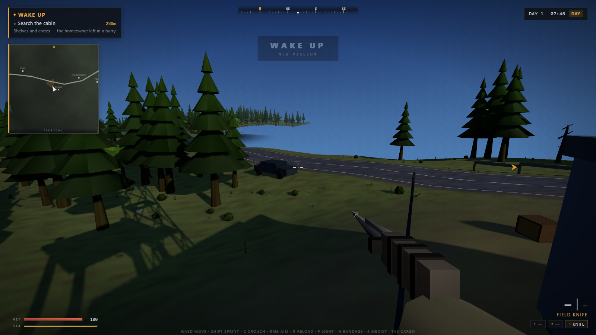

# DEADGRID

> Signal lost. Grid 7. Wilderness protocol.

[Play the latest build](https://thecarsonford-dotcom.github.io/deadgrid/) · [Report a bug](https://github.com/thecarsonford-dotcom/deadgrid/issues/new/choose) · [Join the discussion](https://github.com/thecarsonford-dotcom/deadgrid/discussions)



DEADGRID is an experimental browser-based first-person survival game set in a procedural post-collapse wilderness. Follow a six-mission campaign, scavenge supplies, survive the Hollow, restore the relay, and make it through the blackout.

The original game was created with the locally run model identified in the project configuration as **Qwen3.8 27B Q4_K_M**, using no hosted model API. The repository is also an experiment in building an open-source community where AI-assisted contributions are made with local models. See [Project provenance](docs/PROVENANCE.md) and the [Local-model contribution policy](LOCAL_MODEL_POLICY.md).



## Current state

DEADGRID is playable but pre-alpha. Expect rough edges, incomplete balancing, and visual work in progress. Saves live in the browser's local storage.

Highlights:

- continuous procedural terrain, forests, roads, water, and authored points of interest;
- a six-mission survival campaign with navigation, loot, combat, and blackout events;
- day/night lighting, weathered atmosphere, spatial audio, particles, and decals;
- eight weapons, enemy variants, inventory, survival stats, and local saves;
- no backend, account, telemetry, or network service required to play;
- an optional repository-local OpenCode harness for local-Qwen development.

## Play locally

Requirements: Node.js 22.12 or newer and npm.

```bash
git clone https://github.com/thecarsonford-dotcom/deadgrid.git
cd deadgrid
npm ci
npm run dev
```

Open the local address printed by Vite, normally `http://localhost:3000`.

### Controls

| Action | Input |
| --- | --- |
| Move | `W A S D` or arrow keys |
| Look | Mouse |
| Jump | `Space` |
| Sprint | `Shift` |
| Crouch | `C` or left `Ctrl` |
| Interact | `E` |
| Fire / melee | Left mouse button |
| Aim | Right mouse button |
| Reload | `R` |
| Flashlight | `F` |
| Primary / secondary / melee | `1` / `2` / `3` |
| Medkit / bandage | `4` / `H` |
| Inventory | `Tab` |
| Pause | `Esc` |

## Build and verify

```bash
npm run check
npm run preview
```

`npm run check` runs the strict TypeScript check and a production build. A passing check confirms mechanical health; gameplay feel and visual composition still need human testing.

## Contributing

Human-authored work is welcome. If a contribution uses an AI model, that model must run locally on contributor-controlled hardware—no hosted inference APIs or cloud model services. Read [CONTRIBUTING.md](CONTRIBUTING.md) before opening a pull request. The optional local workflow is documented in [tools/deadgrid-harness/README.md](tools/deadgrid-harness/README.md).

Good first contributions include bug fixes, accessibility, performance, test coverage, mission clarity, environmental variety, and replacing or optimizing art with clearly licensed assets.

## License and assets

The project code and original repository material are available under the [Apache License 2.0](LICENSE). Third-party art and audio retain their own licenses, primarily CC BY 4.0 and CC0; see [THIRD_PARTY_NOTICES.md](THIRD_PARTY_NOTICES.md) before redistributing the game.

The raw asset intake directory is intentionally excluded from the repository. Only runtime assets with verified embedded or accompanying license information are published.

## Community

- Use Issues for reproducible bugs and scoped proposals.
- Use Discussions for ideas, design questions, and local-model workflow help.
- Report security issues privately as described in [SECURITY.md](SECURITY.md).
- Be constructive and follow the [Code of Conduct](CODE_OF_CONDUCT.md).
